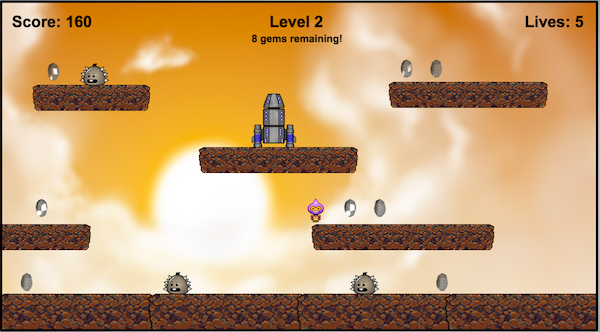
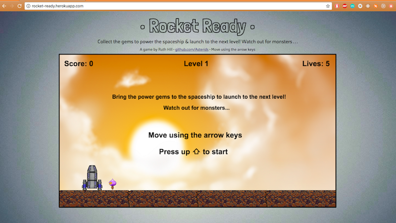

# Rocket Ready

[Rocket Ready live](http://rocket-ready.herokuapp.com/)

Our rocket needs power gems to launch! Collect the gems using the arrow keys and bring them to the spaceship. Watch out for monsters...

## Note

This project was created during a four-day sprint hackathon, and as such it currently functions properly but is sorely in need of a refactor! I am working to make the code modular, after which I will breathe much easier.

## How to Play

- To start the game, press the up arrow key
- Use the left and right keyboard arrow keys to walk left and right, and jump by pressing the up arrow key
- Once at the game over screen or the win screen, you can begin again at the start screen by pressing the up arrow key

## Implementation

### Phaser.io

I made this project during a four-day sprint hackathon using Phaser.io, Node.js, Express, HTML, CSS and Google Fonts. It is the first game I've made. During the course of the hackathon I learned how to define the environment physics of game elements as well as collision and overlap interactions. I created 3 levels, 6 game states, and a reliable current player stats display. I also built an Express server and a user-friendly browser interface.

## What's next for Rocket Ready?

I would primarily like to refactor and optimize the code, after which point I can focus on several additional features including:

### More Gameplay Elements
* More complex monster behavior
* A timer
* The ability of the player to fire a weapon
* Pushable blocks
* A more elaborate scoring system

### A Pause Button
To stop gameplay indefinitely, handled by a specified keyboard input.

### More Levels
Each with increasing difficulty, building upon the last. Ideally I would like to implement at least ten levels.
